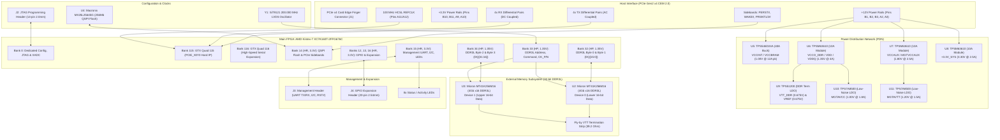

# SYSTEM BLOCK DIAGRAM & ARCHITECTURAL DESCRIPTION
## Project: ORION-X R1.0
## Classification: High-Density FPGA Computing & PCIe Accelerator PCB
## Document ID: ARCH-BLK-001

---

```mermaid
graph TD
    subgraph HOST_INTERFACE ["Host Interface (PCIe Gen2 x4 CEM 2.0)"]
        PCIE_EDGE["PCIe x4 Card Edge Finger Connector (J1)"]
        PWR_12V["+12V Power Rails (Pins B1, B2, B3, A2, A3)"]
        PWR_3V3["+3.3V Power Rails (Pins B10, B11, A9, A10)"]
        PCIE_TX_LANE["4x TX Differential Pairs (AC Coupled)"]
        PCIE_RX_LANE["4x RX Differential Pairs (DC Coupled)"]
        PCIE_CLK["100 MHz HCSL REFCLK (Pins A11/A12)"]
        PCIE_SIDE["Sidebands: PERST#, WAKE#, PRSNT1/2#"]
    end

    subgraph POWER_DISTRIBUTION ["Power Distribution Network (PDN)"]
        U5["U5: TPS546D24A (40A Buck)<br/>VCCINT / VCCBRAM (1.00V @ 12A pk)"]
        U6["U6: TPSM63610 (10A Module)<br/>VCCO_DDR / VDD / VDDQ (1.35V @ 4A)"]
        U7["U7: TPSM63610 (10A Module)<br/>VCCAUX / MGTVCCAUX (1.80V @ 2.5A)"]
        U8["U8: TPSM63610 (10A Module)<br/>+3.3V_SYS (3.30V @ 2.5A)"]
        U9["U9: TPS51200 (DDR Term LDO)<br/>VTT_DDR (0.675V) & VREF (0.675V)"]
        U10["U10: TPS7A8500 (Low-Noise LDO)<br/>MGTAVCC (1.00V @ 1.8A)"]
        U11["U11: TPS7A8500 (Low-Noise LDO)<br/>MGTAVTT (1.20V @ 1.5A)"]
    end

    subgraph FPGA_CORE ["Main FPGA: AMD Kintex-7 XC7K160T-2FFG676C"]
        BANK_0["Bank 0: Dedicated Config, JTAG & XADC"]
        BANK_115["Bank 115: GTX Quad 115 (PCIE_X0Y0 Hard IP)"]
        BANK_116["Bank 116: GTX Quad 116 (High-Speed Serial Expansion)"]
        BANK_14["Bank 14 (HR, 3.3V): QSPI Flash & PCIe Sidebands"]
        BANK_15["Bank 15 (HR, 3.3V): Management UART, I2C, LEDs"]
        BANK_12_13_16["Banks 12, 13, 16 (HR, 3.3V): GPIO & Expansion"]
        BANK_32["Bank 32 (HP, 1.35V): DDR3L Byte 0 & Byte 1 (DQ[15:0])"]
        BANK_33["Bank 33 (HP, 1.35V): DDR3L Address, Command, CK_P/N"]
        BANK_34["Bank 34 (HP, 1.35V): DDR3L Byte 2 & Byte 3 (DQ[31:16])"]
    end

    subgraph MEMORY_SUBSYSTEM ["External Memory Subsystem (32-bit DDR3L)"]
        U2["U2: Micron MT41K256M16 (4Gb x16 DDR3L)<br/>Device 0 (Lower 16-bit Data)"]
        U3["U3: Micron MT41K256M16 (4Gb x16 DDR3L)<br/>Device 1 (Upper 16-bit Data)"]
        VTT_TERM["Fly-by VTT Termination Strip (39.2 Ohm)"]
    end

    subgraph CONFIG_CLOCK ["Configuration & Clocks"]
        U4["U4: Macronix MX25L25645G (256Mb QSPI Flash)"]
        J2["J2: JTAG Programming Header (14-pin 2.0mm)"]
        Y1["Y1: SiT9121 200.000 MHz LVDS Oscillator"]
    end

    subgraph MANAGEMENT_DEBUG ["Management & Expansion"]
        J3["J3: Management Header (UART TX/RX, I2C, RST#)"]
        J4["J4: GPIO Expansion Header (20-pin 2.54mm)"]
        LEDS["8x Status / Activity LEDs"]
    end

    %% Power Connections
    PWR_12V --> U5
    PWR_12V --> U6
    PWR_12V --> U7
    PWR_12V --> U8
    U6 --> U9
    U6 --> U10
    U7 --> U11

    %% Host PCIe Connections
    PCIE_TX_LANE --> BANK_115
    PCIE_RX_LANE --> BANK_115
    PCIE_CLK --> BANK_115
    PCIE_SIDE --> BANK_14

    %% Memory Connections
    BANK_32 <--> U2
    BANK_34 <--> U3
    BANK_33 --> U2
    BANK_33 --> U3
    U2 --> VTT_TERM
    U3 --> VTT_TERM

    %% Config & Clock Connections
    U4 <--> BANK_14
    J2 <--> BANK_0
    Y1 --> BANK_33

    %% Management Connections
    BANK_15 <--> J3
    BANK_12_13_16 <--> J4
    BANK_15 --> LEDS
```

